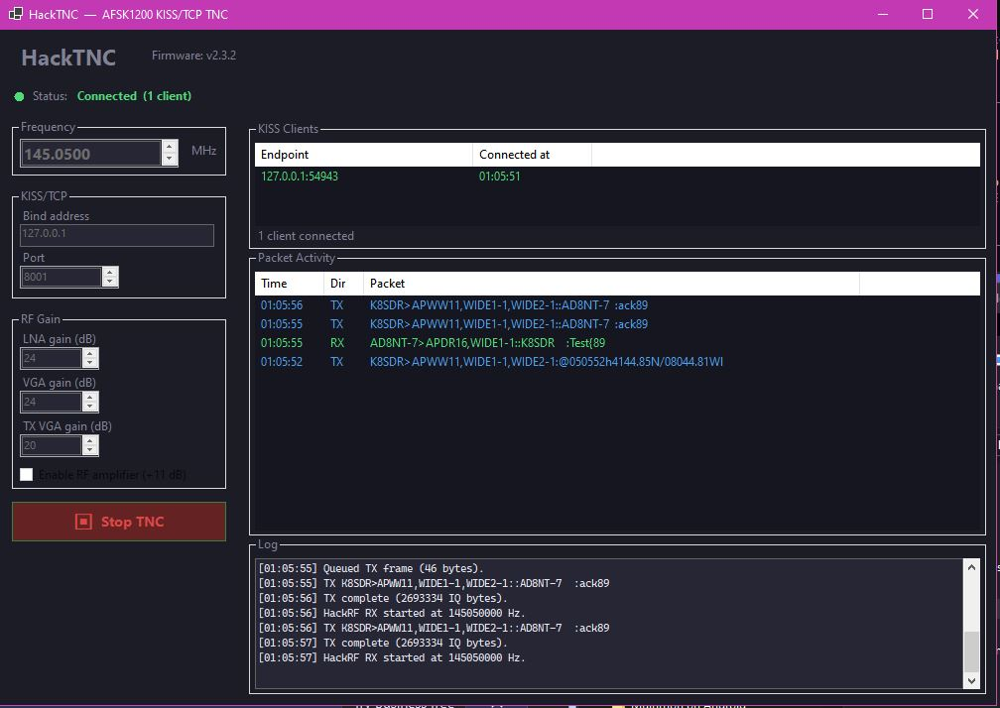

# HackTNC

**HackTNC** turns a [HackRF One](https://greatscottgadgets.com/hackrf/) into an AFSK1200 AX.25 packet radio TNC, accessible over KISS/TCP so any standard packet software (Direwolf, APRS clients, etc.) can connect to it like a hardware TNC.



---

## Features

- **Full-duplex KISS/TCP server** — connect any APRS or packet software to `127.0.0.1:8001`
- **AFSK 1200 baud AX.25** — Bell 202 modem (1200/2200 Hz tones) on any HackRF-supported frequency
- **FM modulation/demodulation** — proper FM discriminator with anti-aliasing decimation filter
- **Half-duplex PTT** — RX is automatically gated off during TX and resumed after
- **Dark-themed WinForms GUI** — frequency selector, RF gain controls, live client list, packet activity log
- **Console app** — headless operation for servers or scripting
- **Configurable**: frequency, KISS port, LNA/VGA/TX-VGA gain, FM deviation, TX delay/tail

---

## Requirements

- Windows 10/11 (x64)
- [.NET 8 Desktop Runtime](https://dotnet.microsoft.com/en-us/download/dotnet/8.0) (GUI) or .NET 8 Runtime (console)
- HackRF One with firmware ≥ v2.0

---

## Quick Start (GUI)

1. Download the latest release and extract the zip
2. Run **`HackTnc.Gui.exe`**
3. Set your frequency (default **144.3900 MHz** — North American APRS)
4. Adjust LNA/VGA gain for your antenna (defaults: LNA 24 dB, VGA 24 dB, TX VGA 20 dB)
5. Click **▶ Start TNC**
6. Connect your packet software to `127.0.0.1:8001` (KISS/TCP)

---

## Quick Start (Console)

```
HackTnc.Console.exe --frequency 144.390M
```

### Console options

| Option | Default | Description |
|---|---|---|
| `--frequency <hz\|kHz\|MHz>` | 144390000 | RF center frequency. Examples: `144390000`, `144390`, `144.390M` |
| `--bind <address>` | 127.0.0.1 | KISS/TCP bind address |
| `--kiss-port <port>` | 8001 | KISS/TCP listen port |
| `--lna-gain <dB>` | 24 | RX LNA gain (0–40, step 8) |
| `--vga-gain <dB>` | 24 | RX VGA gain (0–62, step 2) |
| `--tx-vga-gain <dB>` | 20 | TX VGA gain (0–47) |
| `--fm-deviation <hz>` | 3000 | FM deviation in Hz |
| `--tx-delay <ms>` | 300 | AX.25 TX preamble flags duration |
| `--tx-tail <ms>` | 50 | AX.25 TX tail flags duration |
| `--rx-audio-gain <gain>` | 0 (auto) | FM discriminator gain; 0 = auto-compute |
| `--amp` | off | Enable HackRF RF amplifier (+11 dB) |
| `--antenna-power` | off | Enable HackRF antenna bias tee |
| `--serial <suffix>` | — | Select HackRF by serial suffix |
| `--hackrf-dll <path>` | — | Explicit path to `hackrf.dll` |

---

## Connecting packet software

HackTNC exposes a standard **KISS over TCP** interface. Configure your software as:

| Setting | Value |
|---|---|
| TNC type | KISS/TCP |
| Host | `127.0.0.1` |
| Port | `8001` (or `--kiss-port` value) |

Works with: **Direwolf**, **APRSIS32**, **Xastir**, **UiView32**, **YAAC**, **APRSdroid** (via TCP bridge), and any other KISS/TCP-capable software.

---

## Frequency notes

- **North American APRS:** 144.390 MHz
- **European APRS:** 144.800 MHz
- **UK APRS:** 144.800 MHz
- Bare integers < 10,000,000 are treated as **kHz** (e.g. `145050` → 145.050 MHz)

---

## Architecture

```
HackRF IQ (2 Msps)
    │
    ▼
FM Discriminator  (IQ → instantaneous frequency)
    │
    ▼
Boxcar anti-alias LPF  (decimation factor ~41)
    │
    ▼
Linear interpolation resampler  (→ 48 kHz)
    │
    ▼
AFSK1200 Demodulator  (Bell 202 correlator, NRZI decode)
    │
    ▼
AX.25 frame → KISS/TCP → client software

──────────────────────────────────────────────

Client software → KISS/TCP → AX.25 frame
    │
    ▼
AFSK1200 Modulator  (Bell 202, NRZI, bit-stuffing)
    │
    ▼
FM IQ Encoder  (audio → FM modulated IQ at 2 Msps)
    │
    ▼
HackRF TX  (drain-buffer completion, no flush callback)
```

---

## Building from source

```
git clone https://github.com/SarahRoseLives/HackTNC.git
cd HackTNC
dotnet build -c Release
```

Requires .NET 8 SDK. The native `hackrf.dll`, `libusb-1.0.dll`, and `pthreadVC2.dll` are included in the repo root and are automatically copied to the output directory.

---

## Third-party components

- **AFSK1200 modem DSP** — vendored from [dkxce/AFSK1200Modem](https://github.com/dkxce/AFSK1200Modem) (MIT)
- **libhackrf** — [Great Scott Gadgets](https://github.com/greatscottgadgets/hackrf) (GPL-2.0)
- **libusb** — LGPL-2.1

See `THIRD-PARTY-NOTICES.txt` for full details.
